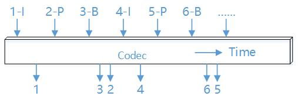

.. _topics-FAQ:

FAQ
=============================

-----------------------------
输入和输出分辨率
-----------------------------

CNCodec支持160x160 ~ 4096x2160的分辨率输入和输出，输入和输出分辨率可以不同，最大支持对输入图像水平和垂直16倍放大，水平和垂直15倍缩小。

不支持的分辨率:

======================== ==============================================
解码数据格式              分辨率                                
======================== ==============================================
mpeg4                    256 x 256 (输入)
======================== ==============================================

-----------------------------
最大通道数量
-----------------------------

CNCodec可创建的通道数量与编解码数据格式、输入和输出分辨率相关，单卡最多可创建64个通道。

后处理降噪功能打开时创建的通道数量会减少，例如h264 1920x1080输入1920x1080输出，通道数量会减少2个。

+------------+--------------------------------+----------------------------+
| decode     | resolution of input and output | maximum number of channels |
+============+================================+============================+
|            | 1920 x 1200 and below          | 64                         |
|            +--------------------------------+----------------------------+
|            | 2048 x 1536                    | 52                         |
|            +--------------------------------+----------------------------+
| jpeg       | 2560 x 1600                    | 42                         |
|            +--------------------------------+----------------------------+
|            | 2560 x 2048                    | 32                         |
|            +--------------------------------+----------------------------+
|            | 4096 x 2160                    | 20                         |
+------------+--------------------------------+----------------------------+
|            | 1280 x 720 and below           | 64                         |
|            +--------------------------------+----------------------------+
|            | 1440 x 900                     | 48                         |
|            +--------------------------------+----------------------------+
|            | 1920 x 1080                    | 32                         |
|            +--------------------------------+----------------------------+
| mpeg4      | 1920 x 1200                    | 28                         |
|            +--------------------------------+----------------------------+
|            | 2048 x 1536                    | 20                         |
|            +--------------------------------+----------------------------+
|            | 2560 x 1600                    | 16                         |
|            +--------------------------------+----------------------------+
|            | 2560 x 2048                    | 12                         |
|            +--------------------------------+----------------------------+
|            | 4096 x 2160                    | 8                          |
+------------+--------------------------------+----------------------------+
|            | 1280 x 720 and below           | 64                         |
|            +--------------------------------+----------------------------+
|            | 1440 x 900                     | 48                         |
|            +--------------------------------+----------------------------+
|            | 1920 x 1080                    | 32                         |
|            +--------------------------------+----------------------------+
| h264       | 1920 x 1200                    | 28                         |
|            +--------------------------------+----------------------------+
|            | 2048 x 1536                    | 20                         |
|            +--------------------------------+----------------------------+
|            | 2560 x 1600                    | 16                         |
|            +--------------------------------+----------------------------+
|            | 2560 x 2048                    | 12                         |
+------------+--------------------------------+----------------------------+

+------------+--------------------------------+----------------------------+
| encode     | resolution of input and output | maximum number of channels |
+============+================================+============================+
|            | 2560 x 2048 and below          | 64                         |
| jpeg       +--------------------------------+----------------------------+
|            | 4096 x 2160                    | 40                         |
+------------+--------------------------------+----------------------------+
|            | 2560 x 2048 and below          | 64                         |
| h264       +--------------------------------+----------------------------+
|            | 4096 x 2160                    | 40                         |
+------------+--------------------------------+----------------------------+

-----------------------------
Switch 带宽
-----------------------------

通过以下命令查看switch带宽：sudo lspci –vvv
 * 第一个PEX 8732 PCI Bridge是switch与host的连接信息，其中的lnkSta是连接状态
 * 当插在x16槽位时，lnkSta：Speed 8GT/s，Width x16
 * 当插在x8槽位时，lnkSta：Speed 8GT/s，Width x8

-----------------------------
图像后处理
-----------------------------

后处理降噪功能打开时创建的通道数量会减少，例如h264 1920x1080输入1920x1080输出，通道数量会减少2个。

后处理裁切后的图像会resize到u32TargetWidthx u32TargetHeight后输出。

后处理去隔行功能开启后，u32MaxWidth不能超过960。

-------------------------------
解码帧率和延时
-------------------------------

CNCodec的解码是异步进行的，内部有解码和传输队列，同一时刻队列中可能存在多个帧，这些帧按照输入到队列的先后顺序排队进入解码器，因此解码帧率和延时没有固定的对应关系，当输入帧率超出解码能力或者数据输出能力时延时会变大。

如下图所示，如果解码帧率是25fps，即每40ms输出1帧解码数据，在t时刻将1帧待解码数据发送到解码队列（橙色数据块），此时如果队列中已存在2帧数据（蓝色数据块），则解码延时（数据从输入到输出的时间）的理论值是120ms。

.. image:: images/delay_decoderate_relationship.jpg

当输入帧率没有超出解码能力或者数据输出能力时，解码帧率和延时仍然没有固定的对应关系。

原因1：流水线结构
--------------------------------

在CNCodec内部，数据输入、解码、数据输出，这些工作是异步进行的（3个流水线），如果每个流水线的处理能力都达到25fps，则实际的解码能力就能达到25fps，例如以下工作状态：

    * 输入，平均每帧数据用时1ms
    * 解码，平均每帧数据用时40ms
    * 输出，平均每帧数据用时30ms

此时解码数据以25fps的帧率输入和输出，但是每帧数据都要经过输入、解码、输出 三个过程，因此每帧数据从输入到输出的延时时71ms。

原因2：视频编码协议
--------------------------------

视频编码协议通常并不是输入1帧编码数据就能输出1帧解码数据，例如h264协议，B帧需要参考之前的I帧和之后的P帧，通常显示序是IBP，编码序是IPB，B帧可以有一个或多个。如下图所示P帧除了解码延时外还有额外的协议延时，B帧越多协议延时越大。整体平均延时就越大。

-------------------------------
P2P模式注意事项
-------------------------------

P2P模式是指解码输出的图像不经过host，直接传递到MLU作为模型的输入数据，需要注意：

* CN_VIDEO_CREATE_ATTR_S.mluP2pAttr.mlu_p2p_addr是MLU接收解码图片的内存信息，此内存需要在创建通道前调用cnrtMallocBufferEx申请:

  .. note::

    * 支持最多16个buffer
    * 每个buffer的空间是1张图像size，每个buffer必须64KB对齐
    * 申请输出内存的数据并行度必须与之后使用此内存做神经网络推理的数据并行度一致
    * 申请输出内存帧数量必须是数据并行度的整数倍

* 离线模型增加YUV输入层的方法:

    修改caffe模型的protext文件: 
        * 输入层改为 *yuv* 数据 
        * 第一层 *shape* 设置为 *yuv* 数据存储格式{1, 1, width*1.5, height}
        * 增加 *yuv* 转 *rgb* 层
    
    .. code-block:: c++

        name: "default"
        layer {
            name: "data"
            type: "Input"
            top: "yuv_data"
            input_param {
                shape {
                dim: 1
                dim: 1
                dim: 336
                dim: 224
                }
            }
        }
        layer {
            name: "yuv2rgb"
            type: "MLUYUVtoRGB"
            bottom: "yuv_data"
            top: "data"
        }

--------------------------------
BGR24和RGB24注意事项
--------------------------------

解码输出和编码输入支持YUV420SP、BGR24、RGB24像素格式，相对于YUV420SP，BGR24和RGB24相同分辨率的图像数据量增加1倍，编解码性能低于YUV420SP。

RGB24还需要额外的颜色空间转换运算，因此使用RGB24像素格式时性能会进一步下降。