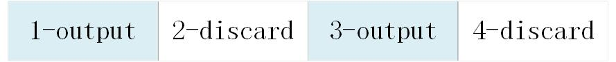

.. _topics-Programming guide:

编程指南
=============================

-----------------------------
重要概念
-----------------------------

通道
-----------------------------

支持CNCodec的板卡可提供一定数量的编解码通道，每个通道就是一个编码器或解码器，可以对1路视频流编码或解码，应用程序使用CNCodec的编解码功能时需要先创建通道，创建成功后即可持续向通道发送数据，编码或解码后的数据通过回调函数向应用程序输出。

输入分辨率
-----------------------------

创建编解码通道时需设置通道的最高输入分辨率，在此范围内的图像可正常编解码，超出此分辨率的图像无法编解码。

输出分辨率
-----------------------------

创建编解码通道时需设置通道的输出分辨率。

 * 解码通道的输出图像时会先resize到输出分辨率再输出
 * 编码通道的输出分辨率 >0 时，小于此分辨率的输入图像将被丢弃，大于或等于此分辨率的输入图像将被resize到输出分辨率再编码输出，输出分辨率为0时，按照输入数据的原始分辨率输出。

像素格式
-----------------------------

CNCodec像素格式在创建通道时设置。

 * 解码输出支持YUV420SP、BGR24、RGB24
 * 编码输入支持YUV420SP、BGR24、RGB24

帧率控制
-----------------------------

CNCodec解码通道支持帧率控制，在创建解码通道时设置是否打开帧率控制功能, 设置输入帧率和输出帧率:

::

    CN_VIDEO_FRAME_RATE_S.bEnable: 是否打开帧率控制功能
    CN_VIDEO_FRAME_RATE_S.s32SrcFrmRate: 输入帧率
    CN_VIDEO_FRAME_RATE_S.s32SrcDstRate: 输出帧率

.. note::

    * 输出帧率不能大于输入帧率
    * 输出帧率与输入帧率设置相同时，不进行帧率控制
    * 输出帧率小于输入帧率时按照 输出帧率/输入帧率 比例匀速抽帧输出

*举例 1*:

输入帧率=20，输出帧率=10，此时每解码2帧输出1帧：

*举例 2*:

输入帧率=25，输出帧率=15，此时每解码5帧输出3帧：

.. image::  images/frame_rate_control_2.jpg

输出内存
-----------------------------

输出内存用于存放输出数据

 * P2P模式输出内存是MLU内存，这些内存空间中的数据可直接用于CNRT的神经网络推理，也可以通过调用CNRT接口复制到host应用程序用户空间
 * 非P2P模式，输出内存是CPU内存。

输出内存使用方法：

创建通道前通过CNRT接口或者malloc申请输出内存并将输出内存信息填充到通道属性结构体，然后创建通道。输出的编解码图像属性结构体中包含输出内存的地址和index，应用程序使用完此内存的数据后调用CNCodec的CN_MPI_MLU_P2P_ReleaseBuffer接口释放，之后此缓存空间可被CNCodec重用。

为了使解码输出达到最大性能，推荐输出内存的数量:

==================== ==============================
数据并行度            输出内存数量         
==================== ==============================
1                    4               
4                    8               
8                    16              
==================== ==============================

数据并行度
-----------------------------

申请输出内存时需指定数据并行度，此数据并行度与CNRT的数据并行度是同一个概念。输出内存的数据并行度必须与之后使用此内存做神经网络推理的数据并行度一致。申请输出内存帧数量必须是数据并行度的整数倍。

码流发送方式
---------------------------------

CNCodec解码器提供两种码流发送方式:

 * 流式发送 (CN_VIDEO_MODE_STREAM): 用户每次可发送任意长度码流到解码器，由解码器内部完成一帧码流的识别过程。须注意，对H.264/H.265/MPEG而言，在收到下一帧码流才能识别当前帧码流的结束，所以在该发送模式下，输入一帧H.264/H.265/MPEG4 码流，不能希望马上开始解码图像。
 * 按帧发送 (CN_VIDEO_MODE_FRAME): 用户每次发送完整一帧码流到解码器，每调用一次发送接口，解码器就认为该帧码流已经结束，开始解码图像，因此需保证每次调用发送接口发送的码流必须为一帧，否则会出现解码错误。通过该发送方式可以达到快速解码的目的。

流控
---------------------------------

当发送数据的速度超过硬件解码能力时CNCodec的流控机制会阻塞发送接口的调用直到有空闲缓存，以此将发送速度调整到硬件支持的最高速度。

--------------------------------------------------------------
解码程序流程
--------------------------------------------------------------

使用CNCodec SDK解码的解码程序流程:
 * 设计解码图像回调函数
 * 初始化SDK
 * 创建通道属性结构体，设置通道属性
 * 申请输出内存
 * 创建解码通道
 * 向解码通道发送数据
 * 销毁通道，释放内存

--------------------------------------
编程示例
--------------------------------------

本节介绍了一个简单的视频解码的例子，完整源码在发布包中cncodec/examples/decode_video.cpp。

以下示例是P2P模式，非P2P模式只需要通过 *malloc* 申请输出内存，详见samples中的源码。

* 包含头文件：

    .. code-block:: c

        #include <stdio.h>
        #include <stdlib.h>
        #include <unistd.h>
        #include <string.h>
        #include "cncodec.h"
        #include "cnrt.h"

* 使用CNCodec需要先调用初始sdk接口，一个进程只需要调用一次。
  
  解码过程使用CNRT接口管理输出缓存，因此也需要初始化CNRT sdk。

    .. code-block:: c

        CN_MPI_Init();
        cnrtInit(0);

* 创建并设置通道属性，其中的user_data是需要传递到回调函数中的数据结构指针，详见samples中的完整源码，CnCallback是在应用程序中定义的解码图像回调函数，将在后面介绍：

    .. code-block:: c

        CN_VIDEO_CREATE_ATTR_S chn_attr;
        memset(&chn_attr, 0, sizeof(chn_attr));
        chn_attr.u32VdecDeviceID = 0;  // 在device 0上创建解码通道
        chn_attr.enInputVideoCodec = CN_VIDEO_CODEC_H264;  // h264解码通道
        chn_attr.enVideoMode = CN_VIDEO_MODE_STREAM;  // 流式发送
        chn_attr.u32MaxWidth = 1920;  // 最大输入分辨率，只能解码此范围内的压缩数据
        chn_attr.u32MaxHeight = 1080;
        chn_attr.u32TargetWidth = 1280;  // 输出分辨率，解码图像resize到此分辨率输出
        chn_attr.u32TargetHeight = 720;
        chn_attr.enOutputPixelFormat = CN_PIXEL_FORMAT_YUV420SP;  // 输出YUV数据
        chn_attr.u64UserData = (CN_U64)&user_data;  // 设置回调函数的用户数据指针，回调函数中需要使用的数据
        chn_attr.pImageCallBack = CnCallback;

* 申请输出内存:

    * 设置当前线程绑定的CNRT device，设置后当前线程的所有操作都是指向绑定的device。

        .. code-block:: c

            cnrtGetDeviceHandle(&user_data.cnrt_dev, 0);  // 获取device 0 的MLU设备号
            cnrtSetCurrentDevice(user_data.cnrt_dev);  // 设置当前线程绑定的device

    * 计算输出图像占用的内存空间frame_size，需要64KB对齐：

        .. code-block:: c

            #define OUTPUT_BUFFER_NUM 4  // 申请4个解码图像输出内存（4个frame）
            CN_U32 frame_size = chn_attr.u32TargetWidth * chn_attr.u32TargetHeight * 3 / 2; 
            frame_size = ALIGN_UP(frame_size, 64 * 1024);
    
    * 申请内存，*MallocOutputBuffer* 为应用程序封装函数，封装了对CNRT *cnrtMallocBufferEx* 接口的调用，详见examples中的完整源码

        .. code-block:: c

            void *mlu_ptrs;
            MallocOutputBuffer(OUTPUT_BUFFER_NUM, frame_size, 1, &mlu_ptrs);

    * 将申请到的虚拟地址做偏移得到每个frame的地址，填充到CN_MLU_P2P_BUFFER_S结构体中，将作为通道属性输入到解码器:

        .. code-block:: c

            CN_MLU_P2P_BUFFER_S buffers[OUTPUT_BUFFER_NUM];
            for (int iloop = 0; iloop < OUTPUT_BUFFER_NUM; iloop++) {
                // 计算每个 *frame buffer* 的虚拟地址和长度，填充配置信息
                buffers[iloop].addr = (CN_U64)mlu_ptrs + (frame_size * iloop);
                buffers[iloop].len = frame_size;
            }
            chn_attr.mluP2pAttr.buffer_num = OUTPUT_BUFFER_NUM;
            chn_attr.mluP2pAttr.p_buffers = buffers;

    * 申请CPU端解码图像内存，解码图像从MLU复制到CPU时使用，如果解码图像不需要复制到CPU则无需申请:
    
        .. code-block:: c

            user_data.p_cpu_image_buffer = malloc(frame_size);

* 创建解码通道

    .. code-block:: c

        CN_MPI_VDEC_Create(&user_data.h_decoder, &chn_attr);

* 向解码通道发送数据，本示例解码一个1080p的h264文件，流式发送，每次从文件中读取10000字节数据，调用CN_MPI_VDEC_Send接口发送，最后一帧数据的nBitstreamDataLen为0，表示当前码流文件结束，解码器会把所有码流全部解完并输出全部图像。

  解码通道创建后可以顺序解码多个视频文件，发送完一个视频文件后可以继续发送其他视频文件。

    .. code-block:: c

        // 加载h264文件, 发送数据
        FILE *fid;
        fid = fopen("../data/1080P.h264", "rb");
        if (fid  ==  NULL) {
            return false;
        }
        CN_U32 read_data_len;
        unsigned char load_data_buffer[10000];
        CN_VIDEO_PIC_PARAM_S  stPicParam;

        while (1) {
            read_data_len = fread(load_data_buffer, 1, sizeof(load_data_buffer), fid);
            stPicParam.nBitstreamDataLen = read_data_len;
            stPicParam.pBitstreamData = (CN_U64)load_data_buffer;
            stPicParam.u64FrameIndex = 0;
            // 发送数据，最后一帧数据的nBitstreamDataLen为0，表示当前码流文 
            // 件结束，解码器会把所有码流全部解完并输出全部图像 
            if (CN_SUCCESS  !=  CN_MPI_VDEC_Send(user_data.h_decoder, &stPicParam)) {
                printf("CN_MPI_VDEC_Send failed!\n");
                break;
            }
            usleep(10000);
            if (read_data_len == 0) {
                break;
            }
        }
        fclose(fid);
        sleep(1);  // 等待队列中的数据全部输出

* 销毁通道，释放内存:

    .. code-block:: c

        CN_MPI_VDEC_Destroy(user_data.h_decoder);  // 销毁通道
        cnrtFree(mlu_ptrs);  // 释放解码图像输出内存
        free(user_data.p_cpu_image_buffer);  // 释放CPU端解码图像内存

* 解码数据回调函数，应用程序可通过回调函数触发显示图像、CNRT推理等任务:

    .. code-block:: c

        // 解码图像回调函数
        CN_VOID CnCallback(CN_VIDEO_IMAGE_INFO_S *p_image_attr, CN_U64 user_data)
        {
            UserData *p_user_data = (UserData *)user_data;
            // u32FrameSize为0表示当前码流文件结束
            if (p_image_attr->u32FrameSize > 0)
            {
                // 设置当前线程绑定的MLU device，复制图像内存MLU->CPU，如果解码图像
                // 不需要复制到CPU则跳过cnrtSetCurrentDevice和cnrtMemcpy
                cnrtSetCurrentDevice(p_user_data->cnrt_dev);
                cnrtMemcpy(p_user_data->p_cpu_image_buffer,
                           (void *)p_image_attr->u64VirAddr,
                           p_image_attr->u32FrameSize,
                           CNRT_MEM_TRANS_DIR_DEV2HOST);
                // 释放MLU缓存buffer，释放后新的解码图像才可以写入此buffer
                CN_MPI_MLU_P2P_ReleaseBuffer(p_user_data->h_decoder, 
                                             p_image_attr->u32BufIndex);
            }
        }