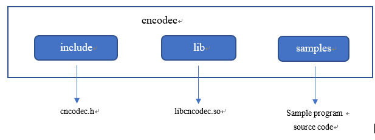

.. _topics-Installation guide:

安装
=============================

-----------------------------
依赖库
-----------------------------

CNCodec有以下软件依赖：
 * Linux OS
 * MLU 驱动

-----------------------------
文件目录
-----------------------------

CNCodec SDK 路径结构:

在CNCodec目录下，主要有三个部分：头文件，库和示例程序源码。

 * include: cndecode.h，CNCodec的头文件
 * lib: libcncodec.so，CNCodec的库文件
 * samples: 示例程序源文件