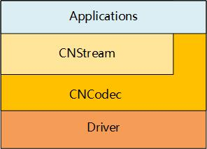

.. _topics-Overview:

概述
=============================

-----------------------------
简介
-----------------------------

CNCodec是搭载MLU100板卡的编解码模块SDK，封装了视频和JPEG图片编解码接口。在兼顾灵活性的同时，可以充分发挥硬件编解码运算性能。

CNCodec提供了一套C语言的API，支持多路并发的编解码通道。使用CNCodec的应用程序只需要创建通道，然后逐帧发送需要解码或编码的数据，在回调函数接收解码或编码后的数据。

-----------------------------
CNCodec 软件栈
-----------------------------

上层流处理应用程序可使用CNStream的接口间接调用CNCodec，也可以直接使用CNCodec接口。

*图1.1.1. Cambricon流处理软件栈结构*

------------------------------
基本功能
------------------------------

 * H.265 Main Profile Level5.1（及以下） 解码
 * H.264 Baseline/Main/High Profile Level5.0（及以下）解码
 * MPEG4 SP L0~L3/ASP L0~L5 解码
 * JPEG Baseline 解码
 * ITU-T H.264 High Profile Level5.1（及以下）编码
 * MJPEG/JPEG Baseline 编码
 * 解码支持输出YUV420SP、BGR24、RGB24
 * 编码支持输入YUV420SP、BGR24、RGB24
 * 支持图像分辨率：160x160 ~ 4096x2160
 * 支持裁剪、去隔行、去噪、锐化、缩放、动态对比度调节