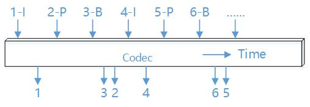

.. _topics-FAQ:

FAQ
=============================

-----------------------------
Input and output resolution
-----------------------------

CNCodec Flexibly supports resolution of input and output in the range of 160x160 ~ 4096x2160, and the input and output resolutions can be different. It supports horizontal and vertical zooming of the input image, and the input image can be maximum enlarged by 16 times and reduced by 15 times.

Unsupported resolution:

+----------------------+-------------------+
| decoding data format | resolution        |
+----------------------+-------------------+
| mpeg4                | 256 x 256 (input) |
+----------------------+-------------------+

-----------------------------
Maximum number of channels
-----------------------------

The number of channels that CNCodec can create is related to the codec data format, input and output resolution, and a single board can create up to 64 channels.

The number of channels created will decrease when the post-processing noise reduction function is turned on. For example, the h264 1920x1080 input 1920x1080 output, the number of channels will be reduced by two when turning on the denoising function.

+------------+--------------------------------+----------------------------+
| decode     | resolution of input and output | maximum number of channels |
+============+================================+============================+
|            | 1920 x 1200 and below          | 64                         |
|            +--------------------------------+----------------------------+
|            | 2048 x 1536                    | 52                         |
|            +--------------------------------+----------------------------+
| jpeg       | 2560 x 1600                    | 42                         |
|            +--------------------------------+----------------------------+
|            | 2560 x 2048                    | 32                         |
|            +--------------------------------+----------------------------+
|            | 4096 x 2160                    | 20                         |
+------------+--------------------------------+----------------------------+
|            | 1280 x 720 and below           | 64                         |
|            +--------------------------------+----------------------------+
|            | 1440 x 900                     | 48                         |
|            +--------------------------------+----------------------------+
|            | 1920 x 1080                    | 32                         |
|            +--------------------------------+----------------------------+
| mpeg4      | 1920 x 1200                    | 28                         |
|            +--------------------------------+----------------------------+
|            | 2048 x 1536                    | 20                         |
|            +--------------------------------+----------------------------+
|            | 2560 x 1600                    | 16                         |
|            +--------------------------------+----------------------------+
|            | 2560 x 2048                    | 12                         |
|            +--------------------------------+----------------------------+
|            | 4096 x 2160                    | 8                          |
+------------+--------------------------------+----------------------------+
|            | 1280 x 720 and below           | 64                         |
|            +--------------------------------+----------------------------+
|            | 1440 x 900                     | 48                         |
|            +--------------------------------+----------------------------+
|            | 1920 x 1080                    | 32                         |
|            +--------------------------------+----------------------------+
| h264       | 1920 x 1200                    | 28                         |
|            +--------------------------------+----------------------------+
|            | 2048 x 1536                    | 20                         |
|            +--------------------------------+----------------------------+
|            | 2560 x 1600                    | 16                         |
|            +--------------------------------+----------------------------+
|            | 2560 x 2048                    | 12                         |
+------------+--------------------------------+----------------------------+

+------------+--------------------------------+----------------------------+
| encode     | resolution of input and output | maximum number of channels |
+============+================================+============================+
|            | 2560 x 2048 and below          | 64                         |
| jpeg       +--------------------------------+----------------------------+
|            | 4096 x 2160                    | 40                         |
+------------+--------------------------------+----------------------------+
|            | 2560 x 2048 and below          | 64                         |
| h264       +--------------------------------+----------------------------+
|            | 4096 x 2160                    | 40                         |
+------------+--------------------------------+----------------------------+

-----------------------------
Switch bandwidth
-----------------------------

Check the switch bandwidth with the following command: sudo lspci –vvv
 * The first *PEX 8732 PCI Bridge* is the connection information between *switch* and *host*, where *lnkSta* is the connection status.
 * When plugged in the *x16* slot, lnkSta: Speed 8GT/s, Width x16
 * When plugged in the x8 slot, lnkSta: Speed 8GT/s, Width x16

-----------------------------
Image post-processing
-----------------------------

The number of channels created will decrease when the post-processing noise reduction function is turned on. For example, the h264 1920x1080 input 1920x1080 output, the number of channels will be reduced by two when turning on the denoising function.

The image is post-processed for cropping, and then resized to *u32TargetWidth x u32TargetHeight* for output.

If the post-processing deinterlacing function is turned on, the u32MaxWidth cannot exceed 960.

-------------------------------
Decoding frame rate and delay
-------------------------------

The decoding of CNCodec is asynchronous. There are decoding and transmission queues inside, and there may be multiple frames in the queue at the same time. These frames are queued into the decoder according to the order of input to the queue. There is no fixed correspondence between the decoding frame rate and the delay, while the delay will become larger when the input frame rate exceeds the decoding capability or data output capability.

As shown in the figure below, if the decoding frame rate is 25 fps, that is, 1 frame of decoded data is output every 40 ms. Suppose that 1 frame of data to be decoded is sent to the decoding queue (orange data block) at time t, and if there are 2 frames of data (blue data block) in the queue, the theoretical value of decoding delay (transmission time of the data from the input to output) is 120ms.

When the input frame rate does not exceed the decoding capability or the data output capability, there is still no fixed correspondence between the decoding frame rate and the delay.

Reason 1: Pipeline structure
--------------------------------

Inside CNCodec, data input, decoding, and data output are executed asynchronously (3 pipelines). If the processing capability of each pipeline reaches 25fps, the actual decoding capability can reach 25fps, for example, in the following working status:

    * input, each frame takes 1ms in average
    * decoding, each frame takes 40ms in average
    * output, each frame takes 30ms in average

the data to be decoded will be input and output at a frame rate of 25 fps, but each frame of data needs to undergo three processes of input, decoding, and output, so the delay of each frame of data from input to output is 71ms (1ms + 40ms + 30ms).

Reason 2: Video coding protocol
--------------------------------

According to the video coding protocol, not one frame of coded data corresponds to one frame of decoded data, such as the h264 protocol, the B frame needs to refer to the previous I frame and the subsequent P frame. Usually, the display sequence is IBP, the coding sequence is IPB, and there may be one or multiple B frames. As shown in the figure below, the P frame has an additional protocol delay in addition to the decoding delay, and the larger the number of B frame is, the larger the protocol delay is, and then the overall average delay is greater.

-------------------------------
P2P mode considerations
-------------------------------

P2P mode means that the decoded output image is directly passed to the MLU as input data of the model without going through the host. Note:

* CN_VIDEO_CREATE_ATTR_S.mluP2pAttr.mlu_p2p_addr is the memory information of the decoded picture received by MLU. This memory needs to be applied by calling *cnrtMallocBufferEx* before creating the channel. Note:

  .. note::

    * supports up to 16 buffers
    * Size of each buffer is equal to the size of 1 image for 64KB aligned
    * The data parallelism of the applied output memory must be consistent with the data parallelism of the subsequent neural network inference performed with this memory
    * The number of the applied output memory frames must be an integer multiple of the data parallelism

* Method of adding YUV input layer to an offline model:

    Modify the prototxt file of the caffe model: 
        * change the *top* of input layer to *yuv data* 
        * set the shape of the first layer to yuv data storage format {1, 1, width*1.5, height}
        * add the *yuv to rgb* layer
    
    .. code-block:: c++

        name: "default"
        layer {
            name: "data"
            type: "Input"
            top: "yuv_data"
            input_param {
                shape {
                dim: 1
                dim: 1
                dim: 336
                dim: 224
                }
            }
        }
        layer {
            name: "yuv2rgb"
            type: "MLUYUVtoRGB"
            bottom: "yuv_data"
            top: "data"
        }

--------------------------------
BGR24 and RGB24 considerations
--------------------------------

The output of decoder and input of encoder support the YUV420SP, BGR24, and RGB24 pixel formats. But compared with the YUV420SP, the amount of data with identical resolution in the format of BGR24 and RGB24 is doubled, so that the codec performance is lower than the YUV420SP format.

In addition, RGB24 requires additional color space conversion operations, so performance may further reduce when using the RGB24 pixel format.