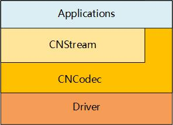

.. _topics-Overview:

Overview
=============================

-----------------------------
Brief
-----------------------------

CNCodec is a codec module SDK for MLU100 board, which encapsulates video and JPEG image decoding and encoding interfaces. While taking into account flexibility, CNCodec can take full advantage of computing performance of hardware.

CNCodec provides a set of C language APIs that support multiple simultaneous decoding or encoding channels. Applications that use CNCodec only need to create channels, then send the data to be decoded or encoded frame by frame, and receive the decoded or encoded image in the callback function.

-----------------------------
CNCodec software stack
-----------------------------

The upper stream processing application can call CNCodec indirectly using the CNStream interface, or directly using the CNCodec interface.

*The picture of Cambricon stream processing software stack structure*

------------------------------
Basic functions
------------------------------

 * H.265 Main Profile Level5.1 (and below) decoding
 * H.264 Baseline/Main/High Profile Level5.0 (and below) decoding
 * MPEG4 SP L0~L3/ASP L0~L5 decoding
 * JPEG Baseline decoding
 * ITU-T H.264 High Profile Level5.1 (and below) encoding
 * MJPEG/JPEG Baseline encoding
 * Supported output formats after decoding: YUV420SP, BGR24, RGB24
 * The encoding surports to input YUV420SP, BGR24, RGB24
 * Supported image resolution: 160x160 ~ 4096x2160
 * Support cropping, deinterlacing, denoising, sharpening, zooming, dynamic contrast adjustment