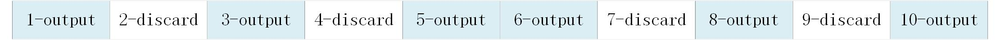

.. _topics-Programming guide:

Programming guide
=============================

-----------------------------
Important concepts
-----------------------------

Channel
-----------------------------

The board supporting CNCodec can provide a certain number of encoding and decoding channels. Each channel is a decoder or encoder, which can decode or encode one channel of video stream. When the application uses encoding or decoding function of CNCodec, it needs to create a channel first. Then the application sends data to the channel, and the encoded and decoded image is output to the application through a callback function.

The input resolution
-----------------------------

When creating a channel, you need to set the highest input resolution of the channel. The data in this range can be encoded or decoded normally. The data beyond this resolution cannot be encoded or decoded.

The output resolution
-----------------------------

When creating a channel, you need to set the output resolution of the channel. 

 * Decoder: decoding channel will resize the image to the output resolution when outputting the image.
 * Encoder: when the output resolution of the encoding channel is greater than 0, the input image with smaller resolution will be discarded, and if the resolution of an input image is greater than or equal to the output resolution, the resolution of the image will be resized to the output resolution. When the output resolution is 0, the input image will be output according to its original resolution.

Output pixel format
-----------------------------

CNCodec supports YUV420SP, RGB24, and BGR24 output formats. The output pixel format is set when creating channel.

Frame rate control
-----------------------------

CNCodec supports frame rate control. You need to set the following three parameters when creating a channel.

::

    CN_VIDEO_FRAME_RATE_S.bEnable: Whether to turn on the frame rate control function
    CN_VIDEO_FRAME_RATE_S.s32SrcFrmRate: The input frame rate
    CN_VIDEO_FRAME_RATE_S.s32SrcDstRate: The output frame rate

.. note::

    * The output frame rate cannot be greater than the input frame rate
    * The frame rate control is not performed when the output frame rate is the same as the input frame rate setting
    * When the output frame rate is less than the input frame rate, the frame is output at a uniform rate according to the *output frame rate / input frame rate*.

*Example 1*:

The input frame rate is set to 20, output frame rate is set to 10, At this time, 1 frame is output every 2 frames of decoding. As the picture shows:

.. image::  images/frame_rate_control_1.jpg
    :width: 285
    :height: 30

*Example 2*:

The input frame rate is set to 25, output frame rate is set to 15, At this time, 3 frame is output every 5 frames of decoding. As the picture shows:

Data parallelism
-----------------------------

When applying for output memory, you need to specify the data parallelism. This data parallelism is the same concept as the data parallelism of CNRT. The data parallelism of the output memory must be consistent with the data parallelism of data which is later used for neural network inference. The number of application output memory frames must be an integer multiple of the data parallelism.

Output memory
-----------------------------

The output memory is used to store output data. 

 * P2P mode: The data in these memory spaces can be directly used for CNRT neural network inference, or can be copied to the host application user space by calling the CNRT interface.
 * non-P2P mode: The output memory refers to a CPU memory.

Output memory usage method: 

::

    Before creating a channel, apply for output memory through the *malloc* or *CNRT* interface 
    and fill the output memory information into the channel attribute structure, and then create a channel. The 
    output decoded image attribute structure contains the address and index of the output memory. After the 
    application uses the data of the memory, it calls the CN_MPI_MLU_P2P_ReleaseBuffer interface of CNCodec to 
    release, and then the buffer space can be reused by CNCodec.

In order to maximize the performance of the decoding output, the number of recommended output memory is given here:

+--------------------+------------------------------+
|  data parallelism  |  Output memory frame number  |
+====================+==============================+
|         1          |              4               |
+--------------------+------------------------------+
|         4          |              8               |
+--------------------+------------------------------+
|         8          |              16              |
+--------------------+------------------------------+

Code stream transmission methods
---------------------------------

CNCodec decoder provides two methods to send streams:
 * Send by stream (CN_VIDEO_MODE_STREAM): The user can send a stream of an arbitrary length to the decoder each time, and the identification process of one frame is completed by the decoder. It should be noted that for H.264/H.265/MPEG, the end of a current frame is recognized only after the next frame is received, so in this transmission mode, the decoding of image may not start immediately after a frame of H.264 / H.265 /MPEG4 stream is entered, you can't hope to start decoding images right away.
 * Send by frame (CN_VIDEO_MODE_FRAME): Each time the user sends a complete frame to the decoder, each time the transmit interface is called, the decoder considers that the frame has ended and starts decoding the picture, so it must be ensured that the data sent by the sending interface must be one frame each time, otherwise a decoding error will occur. This transmission method can achieve the purpose of fast decoding.

flow control
---------------------------------

When the speed of sending data exceeds the hardware decoding capability, CNCodec's flow control mechanism blocks the sending interface's call until there is a free cache, thereby adjusting the sending speed to the maximum speed supported by the hardware.

--------------------------------------------------------------
Procedure of decoding program uses CNCoedc SDK
--------------------------------------------------------------

Procedure of decoding program uses CNCoedc SDK:
 * Design the callback function of decoded image
 * Initialize the SDK
 * Create the structure of channel attribute and set the channel attribute
 * Apply for output memories.
 * Create decoding channels
 * Send data to the decoding channel
 * Destroy the channel and free the memory

--------------------------------------
A programming example
--------------------------------------

This part describes a simple example of video decoding. The full source code is *cncodec/examples/decode_video.cpp* in the release package.

The following example is P2P mode. for non-P2P mode, it is  only needed to apply for output memories through *malloc*. For details, see the source code in samples.

* the header files are included

    .. code-block:: c

        #include <stdio.h>
        #include <stdlib.h>
        #include <unistd.h>
        #include <string.h>
        #include "cncodec.h"
        #include "cnrt.h"

* To use CNCodec, the initial sdk interface needs to be called first. For each process, the initial sdk interface only needs to be called once.
  
  The decoding process uses the CNRT interface to manage the output buffer, so it is also necessary to initialize the CNRT sdk.

    .. code-block:: c

        CN_MPI_Init();
        cnrtInit(0);

* Create and set the channel attributes, where *user_data* is the data 
  structure pointer that needs to be passed to the callback function. 
  See detail in the full source code in samples. CnCallback is the decoded 
  image callback function defined in the application, which will be 
  described later:

    .. code-block:: c

        CN_VIDEO_CREATE_ATTR_S chn_attr;
        memset(&chn_attr, 0, sizeof(chn_attr));
        chn_attr.u32VdecDeviceID = 0;  // create a decoding channel on device 0
        chn_attr.enInputVideoCodec = CN_VIDEO_CODEC_H264;  // h264 decoding channel
        chn_attr.enVideoMode = CN_VIDEO_MODE_STREAM;  // send by stream
        chn_attr.u32MaxWidth = 1920;  // the maximum input resolution
        chn_attr.u32MaxHeight = 1080;
        chn_attr.u32TargetWidth = 1280;  // output resolution, decoded image is to be resized to this resolution to output
        chn_attr.u32TargetHeight = 720;
        chn_attr.enOutputPixelFormat = CN_PIXEL_FORMAT_YUV420SP;  // output the YUV data
        chn_attr.u64UserData = (CN_U64)&user_data;  // set the user data pointer of the callback function, the data to be used in the callback function
        chn_attr.pImageCallBack = CnCallback;

* Apply for output memories:

    * Set the CNRT device bound to the current thread. After the setting, all operations of the current thread point to the bound device.

        .. code-block:: c

            cnrtGetDeviceHandle(&user_data.cnrt_dev, 0);  // get the MLU device number of device 0
            cnrtSetCurrentDevice(user_data.cnrt_dev);  // set the bound device of current thread

    * Calculate the memory space occupied by the output image *frame_size*, which requires 64KB alignment：

        .. code-block:: c

            #define OUTPUT_BUFFER_NUM 4  // apply output memories for 4 decoded image (4 frames)
            CN_U32 frame_size = chn_attr.u32TargetWidth * chn_attr.u32TargetHeight * 3 / 2; 
            frame_size = ALIGN_UP(frame_size, 64 * 1024);
    
    * Applying for memory, *MallocOutputBuffer* is an application wrapper 
      function that encapsulates the call to the CNRT *cnrtMallocBufferEx* 
      interface. See the full source code in examples:

        .. code-block:: c

            void *mlu_ptrs;
            MallocOutputBuffer(OUTPUT_BUFFER_NUM, frame_size, 1, &mlu_ptrs);

    * The address of each frame is obtained by offsetting the applied virtual address, and then filled into the CN_MLU_P2P_BUFFER_S structure to be input as a channel attribute to the decoder:

        .. code-block:: c

            CN_MLU_P2P_BUFFER_S buffers[OUTPUT_BUFFER_NUM];
            for (int iloop = 0; iloop < OUTPUT_BUFFER_NUM; iloop++) {
                // calculate the virtual address and length of each *frame buffer*·, fill in the configuration information
                buffers[iloop].addr = (CN_U64)mlu_ptrs + (frame_size * iloop);
                buffers[iloop].len = frame_size;
            }
            chn_attr.mluP2pAttr.buffer_num = OUTPUT_BUFFER_NUM;
            chn_attr.mluP2pAttr.p_buffers = buffers;

    * Apply memory for the decoded image on CPU, which is used when copying the decoded image from the MLU to the CPU. If the decoded image does not need to be copied to the CPU, this step is not performed:
    
        .. code-block:: c

            user_data.p_cpu_image_buffer = malloc(frame_size);

* Create a decoding channel

    .. code-block:: c

        CN_MPI_VDEC_Create(&user_data.h_decoder, &chn_attr);

* Send data to the decoding channel. This example shows the decoding of a 1080p h264 file. The data is sent by stream. 10000 bytes of data are read from the file each time and sent by calling *CN_MPI_VDEC_Send* interface. nBitstreamDataLen of the last frame of the data is 0, which indicates the end the current stream. After receiving the last frame, the decoder will output all the cached image.

  After the decoding channel is created, multiple video files can be decoded sequentially, and after a video file is sent, other video files can be sent successively.

    .. code-block:: c

        // load h264 file, send data
        FILE *fid;
        fid = fopen("../data/1080P.h264", "rb");
        if (fid  ==  NULL) {
            return false;
        }
        CN_U32 read_data_len;
        unsigned char load_data_buffer[10000];
        CN_VIDEO_PIC_PARAM_S  stPicParam;

        while (1) {
            read_data_len = fread(load_data_buffer, 1, sizeof(load_data_buffer), fid);
            stPicParam.nBitstreamDataLen = read_data_len;
            stPicParam.pBitstreamData = (CN_U64)load_data_buffer;
            stPicParam.u64FrameIndex = 0;
            // send data, the nBitstreamDataLen of the last frame of data is 0, indicating 
            // the end of the current stream. 
            if (CN_SUCCESS  !=  CN_MPI_VDEC_Send(user_data.h_decoder, &stPicParam)) {
                printf("CN_MPI_VDEC_Send failed!\n");
                break;
            }
            usleep(10000);
            if (read_data_len == 0) {
                break;
            }
        }
        fclose(fid);
        sleep(1);  // wait for all data in the queue to be output

* Destroy the channel and free the memory:

    .. code-block:: c

        CN_MPI_VDEC_Destroy(user_data.h_decoder);  // destroy the channel
        cnrtFree(mlu_ptrs);  // free the output memory for decoded image on MLU
        free(user_data.p_cpu_image_buffer);  // free the output memory for decoded image on CPU

* The callback function for decoded data, the application can trigger tasks through the callback function such as displaying image, CNRT inference and the like:

    .. code-block:: c

        // callback function for decoded image data
        CN_VOID CnCallback(CN_VIDEO_IMAGE_INFO_S *p_image_attr, CN_U64 user_data)
        {
            UserData *p_user_data = (UserData *)user_data;
            // u32FrameSize equals 0, indicating the end of the current stream file
            if (p_image_attr->u32FrameSize > 0)
            {
                // set the MLU device bound to current thread, copy the image memory MLU->CPU, 
                // and skip the cnrtSetCurrentDevice and cnrtMemcpy if the decoded image does 
                // not need to be copied to the CPU.
                cnrtSetCurrentDevice(p_user_data->cnrt_dev);
                cnrtMemcpy(p_user_data->p_cpu_image_buffer,
                           (void *)p_image_attr->u64VirAddr,
                           p_image_attr->u32FrameSize,
                           CNRT_MEM_TRANS_DIR_DEV2HOST);
                // release the MLU cache buffer, after release, the new decoded image can be 
                // written to this buffer.
                CN_MPI_MLU_P2P_ReleaseBuffer(p_user_data->h_decoder, 
                                             p_image_attr->u32BufIndex);
            }
        }