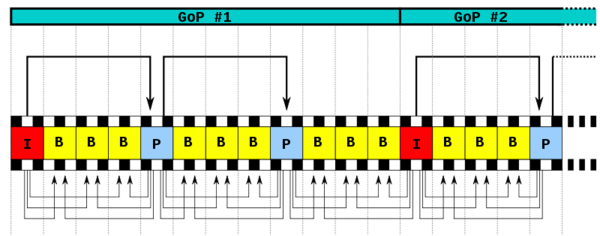

## markdown常用语法

---

以下是常用语法的举例

---

# 这是一级标题
## 这是二级标题
### 这是三级标题
#### 这是四级标题
##### 这是五级标题
###### 这是六级标题

---

**这是加粗的文字**
*这是倾斜的文字*`
***这是斜体加粗的文字***
~~这是加删除线的文字~~

---

### 列表
无序列表：
* 第一项
* 第二项
* 第三项

有序列表：
1.列表内容
2.列表内容
3.列表内容

列表嵌套：
上一级和下一级之间敲三个空格缩进即可
* 一级无序列表内容
   * 二级无序列表内容
   * 二级无序列表内容
   * 二级无序列表内容

* 一级无序列表内容
   * 二级无序列表内容
   * 二级无序列表内容
   * 二级无序列表内容

---

### 分割线

三个或者三个以上的 - 或者 * 都可以。

示例：

---
----
***
*****

### 图片


图片alt就是显示在图片下面的文字，相当于对图片内容的解释。
图片title是图片的标题，当鼠标移到图片上时显示的内容。title可加可不加


---

### 表格

表头|表头|表头
---|:--:|---:
内容|内容|内容
内容|内容|内容

---

### 代码

单行代码：代码之间分别用一个反引号包起来
`printf("hello");`

代码块：代码之间分别用三个反引号包起来，且两边的反引号单独占一行
```
    function fun(){
         echo "这是一句非常牛逼的代码";
    }
    fun();
```

### 流程图

```flow
st=>start: 开始
op=>operation: My Operation
cond=>condition: Yes or No?
e=>end
st->op->cond
cond(yes)->e
cond(no)->op
&```


`


